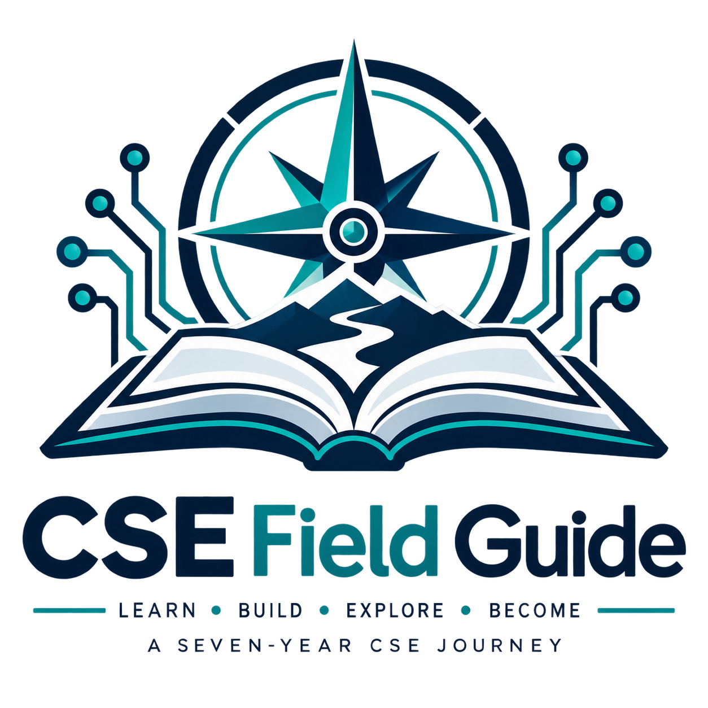
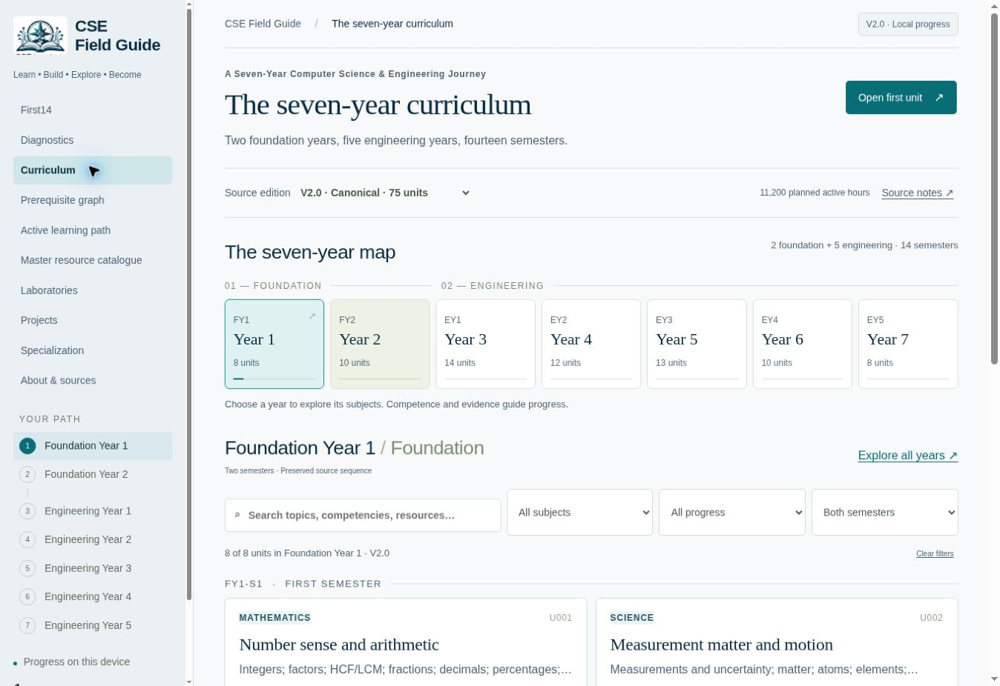

<p align="center"></p>

# CSE Field Guide

**Learn • Build • Explore • Become**

A rigorous seven-year self-directed Computer Science & Engineering education and mastery system. CSE Field Guide turns the **CSE Engineer Master Package V2.0** into a navigable learning workspace: a preserved curriculum, explicit dependencies, carefully scoped study routes, engineering laboratories, projects, and evidence-based local progress. It is designed for sustained study across computing, science, mathematics, and engineering practice.

**Live website / intended project address:** [cse.rishik.tech](https://cse.rishik.tech) — domain connection is pending.

**Current working deployment:** [CSE Field Guide on ChatGPT Sites](https://seven-cse-field-guide.contact246469.chatgpt.site).

No DNS, Vercel, or portfolio changes are part of this release.



## Project overview

A large reading list does not explain what to learn next or what counts as understanding. This project connects units to prerequisites, selected chapters, practice, experiments, and learning evidence. It preserves the complete seven-year architecture while making the next useful step easier to find.

V2.0 is the canonical edition. The older checkpoint and incomplete 69-unit Gold branch remain available as clearly labelled archives, with separate progress records. They do not replace or reduce the 75-unit curriculum.

## Curriculum at a glance

| Component | Planned scope |
| --- | ---: |
| Foundation Years | 2 |
| Engineering Years | 5 |
| Semesters | 14 |
| Units | 75 — U001–U075 |
| Planned Active Hours | 11,200 |
| Laboratory Sequences | 38 |
| Projects | 24 |
| Primary Specialization | 1, selected from 16 supplied tracks |

Lab and project hours belong to their parent-unit allocations; they are not added again to the total. Planned hours are a study budget, not a promise of mastery or a required calendar pace.

The master catalogue contains **1,550 resource records**, preserving **all 473 original resource IDs**. Catalogue membership does not mean every resource must be completed.

## What it covers

- **Mathematics and sciences:** arithmetic through calculus, linear algebra, probability, statistics, discrete mathematics, proof, physics, chemistry, and materials.
- **Engineering foundations:** electrical circuits, measurement, electronics, digital logic, engineering graphics and CAD, design, and hardware/software interfaces.
- **Core computing:** programming, data structures, algorithms, architecture, operating systems, databases, networks, theory of computation, compilers, and programming languages.
- **Advanced work:** AI/ML, security, distributed systems, parallel computing, embedded and real-time systems, graphics/HCI, specialization, literature review, reproduction, and bounded research.
- **Engineering practice:** requirements, trade-offs, testing, reliability, performance, documentation, communication, ethics, maintenance, and defensible evidence.

## Features

- **Curriculum explorer:** Year → Semester → Unit navigation, topic and progress filters, unit details, and shareable hash routes.
- **Prerequisite graph:** all 75 units; inspect hard prerequisites, staged co-requisites, and same-semester module gates separately.
- **First14 and diagnostics:** fourteen starting sessions and DIAG-01–DIAG-28, with answer review available after an attempt is submitted.
- **Active learning path:** fourteen semester queues and exact per-unit scopes, using NOW, NEXT, REFERENCE, OPTIONAL, LATER, and ARCHIVE categories.
- **Master resource catalogue:** search by title, creator, topic, or ID; filter by type, mapped year, and exact current verification status. There is no 1,550-item completion checklist.
- **Laboratories and projects:** source contracts, modes, measurements, safety notes, assessments, allocations, and evidence records.
- **Specialization:** select one primary track while keeping the supplied alternatives and literature maps available.
- **Progress tracking:** browser-local unit, First14, diagnostic, lab, and project records; validated JSON backup import/export. Previous-edition progress stays separate.
- **Verification and provenance:** preserved status strings, dates, access limits, original source rows, source-qualified aliases, and complete resource records.

## How to start

1. Open **First14** and establish your learning, error, reading, and evidence logs.
2. Attempt **Diagnostics** independently. Submit your reasoning before opening the review key; classify weaknesses using evidence.
3. Go to **Foundation Year 1**, then **U001–U004**. Repair missing prerequisites before dependent work.
4. Follow the **Active learning path** for the current semester. Use the catalogue when a mapped task or a specific gap calls for it.
5. Record actual problem solving, experiments, tests, reports, and explanations. Export a progress backup regularly, especially before changing browsers or domains.

Marking a unit complete is a self-report. It does not complete its prerequisites or certify competence.

## Architecture

The application is a dependency-free static site built with HTML, CSS, and browser JavaScript. The existing navigation, cards, dialogs, filters, and progress workflow are extended incrementally for V2.0.

| Layer | Files | Responsibility |
| --- | --- | --- |
| Curriculum | `data/curriculum.json` | Units, dependencies, module gates, maps, First14, active scopes, tracks, and source corrections |
| Resources | `data/resources.json` | Canonical 1,550-record catalogue, including verification and access metadata |
| Labs/projects | `data/practice.json` | Full laboratory and project contracts with parent-unit allocations |
| Diagnostics | `data/diagnostics.json`, `data/diagnostic-keys.json` | Learner questions and separately loaded review keys |
| Provenance | `data/provenance.json` | Historical rows, source-qualified aliases, collisions, verification evidence, and audits |
| Source preservation | `data/source-manifest.json`, `data/source-views.json` | Source hashes, baseline ID checks, supplementary planning tables, and original grouped snapshots |
| Archived editions | `data/legacy-editions.json` | Existing checkpoint and Gold data, kept separate from V2.0 |
| Application | `web/` | Rendering, navigation, search, local progress, and official branding |

The initial learner payload excludes diagnostic answer keys and the larger provenance history. Keys load only after submission/review; provenance loads on request. Because this is open static software, keys remain inspectable in the repository and by someone deliberately fetching the file. Diagnostics are independent practice, not secure examinations.

There is no application backend, account database, analytics, or cloud progress synchronization. The hosting provider may apply its own access controls. Personal learning records remain in the browser unless the learner exports or shares a backup.

## Resource verification

Verification describes the specific evidence recorded by the source, at its recorded date. A working URL alone does not establish legal full-text access, correct scope, video playback, code execution, licensing, or learning quality. This synchronization performs **no new external-resource verification**.

The canonical primary status field contains:

| Preserved status | Records | Interpretation |
| --- | ---: | --- |
| PAGE VERIFIED | 570 | Page identity, visible metadata, or official linkage was checked; downstream access may remain uncertain. |
| DIRECT ACCESS VERIFIED | 60 | The source records direct access to the inspected content; other claims still require their own evidence. |
| NOT VERIFIED | 876 | The required verification is not established. |
| RESTRICTED | 39 | Access is restricted or requires conditions recorded in the resource. |
| BROKEN | 5 | The source records a broken route. Retained for traceability and possible repair. |

Other fields and historical rows retain their exact supplied labels and explanations, including metadata/bibliography checks, access/playback limitations, archived records, and designed but unexecuted activities. Do not promote one kind of check into another. The catalogue filter uses the current primary status; inspect resource details for the other dimensions.

Aliases are qualified by source release. A historical identifier reused for a different resource must not be globally rewritten. Duplicate mapping rows are retained in the data and grouped only for display.

## Local development

Prerequisite: **Node.js 20 or newer**. Python 3 is needed only to re-import an authorized source package.

```sh
git clone https://github.com/rishikkumar84a/cse-field-guide.git
cd cse-field-guide
npm run dev
```

Open `http://localhost:5173`. No dependency installation, API key, environment file, database, or account setup is required. The development server also accepts `--host` and `--port`, for example:

```sh
npm run dev -- --host 127.0.0.1 --port 8080
```

Create the production output with:

```sh
npm run build
```

Serve the resulting `dist/` directory with a static HTTP server. Opening `index.html` directly as a `file:` URL will not reliably load the JSON data.

## Project structure

```text
data/                         Canonical and archived structured data
web/
  index.html                  App shell and social metadata
  app.js                      Existing explorer, dialogs, filters and progress
  features.js                 V2.0 views and source adapters
  style.css                   Existing design system
  rebrand.css                 Identity and responsive refinements
  assets/                     Supplied logo, favicon and social preview
scripts/
  sync-v2.py                  Deterministic, lossless source import
  build.mjs                  Copies web/ and data/ into dist/
  dev.mjs                    Local static development server
  check-syntax.mjs            JavaScript syntax checks
tests/                        Data-integrity and progress regression tests
docs/                         Release validation evidence
.openai/hosting.json           Existing Sites deployment manifest
LICENSE                       MIT license for original project work
CONTRIBUTING.md                Code, curriculum and resource change guidance
SECURITY.md                    Vulnerability reporting and privacy boundaries
CHANGELOG.md                   Release changes
CITATION.cff                   Project citation metadata
```

`dist/`, local environment files, source ZIPs/PDFs/spreadsheets, temporary previews, and test output are excluded from Git.

## Testing

```sh
npm test
npm run lint
npm run build
```

Tests check IDs, counts, planned hours, original-ID preservation, exact source field hashes, dependency references, source aliases, resource mappings, diagnostic-key separation, and progress backup validation. They also check legacy progress isolation, reload persistence of stored records, invalid-import rejection, and protection of unreadable saved data.

`npm run lint` is a JavaScript syntax check; this repository does not claim a separate style-lint engine. Browser review covers the navigation, filters, dialogs, diagnostics, progress, and responsive layouts; see [release validation](docs/VALIDATION.md) for the actual tested scope and limitations.

To re-import the same canonical V2.0 data from authorized local source files:

```sh
python3 scripts/sync-v2.py /path/to/package_data.json /path/to/original-resource-database.json
npm test
```

The importer reads JSON only; it does not execute archive scripts. The manifest identifies the canonical recovery source and its SHA-256. Original ZIPs and third-party source content are not distributed with the application.

## Deployment

The current application uses **ChatGPT Sites static hosting**. `npm run build` produces `dist/`; the existing `.openai/hosting.json` selects that directory. A release uses a committed and pushed source state, a saved build artifact, and a Sites deployment of that saved version. The project identifier in the manifest is hosting identity, not a credential; forks must use their own hosting project.

Hash routes keep unit and view navigation compatible with static hosting. The development server is not a production service. There are no runtime secrets or server-side application services to configure.

[cse.rishik.tech](https://cse.rishik.tech) is the intended project domain. Its connection is deliberately deferred. No Vercel project, custom-domain attachment, DNS change, or replacement of [rishik.tech](https://rishik.tech) is performed by this repository release. Social-image URLs currently reference the working Sites deployment and should be updated when a domain migration is explicitly authorized.

## Contributing

Code fixes, accessibility improvements, documentation corrections, and evidence-backed resource updates are welcome. Open an issue describing the problem and affected IDs, then propose a focused pull request. Keep curriculum changes separate from resource verification and interface changes.

Preserve IDs, planned hours, prerequisite semantics, source history, and verification distinctions. Record exact evidence for a status change; do not change a status merely because a URL responds. Follow [CONTRIBUTING.md](CONTRIBUTING.md) and the [code of conduct](CODE_OF_CONDUCT.md). Report sensitive security issues using [SECURITY.md](SECURITY.md).

## License

Original source code, original project documentation, and original curriculum organization/metadata are available under the [MIT License](LICENSE). This license grants only rights held by the project. It does not relicense referenced third-party works or imply endorsement through the project name or logo.

## Content / copyright

Third-party books, papers, courses, videos, repositories, standards, and documentation are **linked or referenced**. They are not republished as project-owned content. Their authors, publishers, institutions, and other rights holders retain their rights. Follow the license, access conditions, and attribution requirements at each original source. A free-to-read page is not necessarily freely redistributable.

Resource titles, citations, links, and provenance describe external material. No university logo is used, and the project claims no university affiliation.

## Limitations

- This is **self-directed education**. It does not award a university degree or provide accredited credits.
- Resource availability and access conditions can change. Some catalogue resources remain unverified, restricted, broken, or quarantined by the source.
- Planned breadth, hours, and completion marks do not establish equivalence to an accredited programme or guarantee employment.
- Curriculum completion requires actual learning evidence, independent work, laboratory practice, assessment, and review.
- Browser storage is device/origin-specific and can be cleared or unavailable. Keep backups; changing domains does not transfer progress automatically.
- A simulation does not substitute for physical competence. Follow each lab's prerequisites and safety constraints, with suitable supervision where needed.
- No claim is made that every linked course was completed, every video played, every code example executed, or every catalogue item newly verified.

## Author / maintainer

**Rishik Kumar Chaurasiya**

Portfolio: [rishik.tech](https://rishik.tech)

Use [CITATION.cff](CITATION.cff) when referencing the project. Cite original external resources separately when using them.
